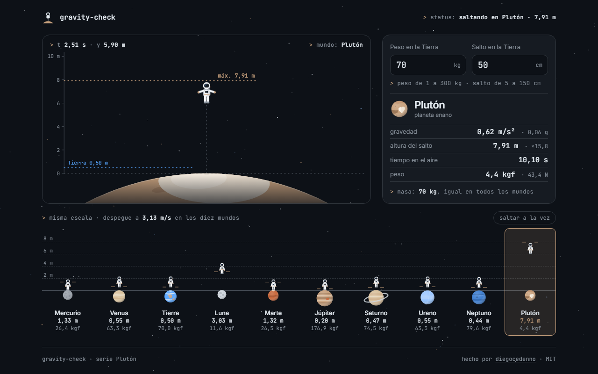

# gravity-check

> Type your weight and how high you jump: an astronaut repeats that jump on the eight planets, the Moon and Pluto, with the real physics of each gravity.
>
> Escribe tu peso y cuánto saltas: un astronauta repite ese salto en los ocho planetas, la Luna y Plutón, con la física real de cada gravedad.

**[English](#english)** · **[Español](#español)**

---

## English

### What it does

- Enter your weight (kg) and your vertical jump on Earth (cm).
- The main scene shows one world: an astronaut jumps beside a ruler in metres, on ground with that world's colour and curvature, while a console reads gravity, jump height, air time and weight (kgf and newtons).
- The strip below shows all ten worlds on one common scale, every astronaut jumping at the pace of its own gravity. Pick a world there — click, tap or arrow keys — to bring it to the main scene.
- `saltar a la vez` makes all ten take off together, so you can watch Jupiter land several times before Pluto comes down once.
- Your data and the chosen world survive a reload (`localStorage`).

### What makes it technically interesting

- **The jump is physics, not an easing.** Legs give the same push everywhere, so take-off speed is the Earth one, `v0 = √(2·g_E·h_E)`. Each frame evaluates `y(t) = v0·t − ½·g·t²` against a real clock: with a 50 cm jump, Pluto takes 10.1 s and reaches 7.9 m, Jupiter 0.25 s and 0.2 m. Easing curves live only in the crouch before take-off and the landing.
- **One loop, eleven astronauts, transforms only.** A single `requestAnimationFrame` drives the main astronaut and the ten small ones from one pure function, `pose(jump, t)`. Per frame it writes only `transform` and `opacity`, and skips the write when nothing changed. It pauses with `document.hidden`.
- **A knee that bends.** The astronaut is an inline SVG with jointed legs: thigh and shin rotate in opposite directions, so the knee moves out while the boot stays planted.
- **Two answers to the scale problem (0.2 m to 8 m).** The main scene rescales to the selected jump and redraws its ruler with round steps; the strip keeps one scale for all ten worlds so the comparison reads at a glance.
- **Pixel-sized SVG.** The scene's `viewBox` matches its size in CSS pixels, so ruler labels never shrink on a phone.
- **Horizon by planet size.** The ground is the world's limb; its on-screen radius follows a log scale of the real radius — Pluto is clearly a ball, Jupiter is almost flat.
- **Reduced motion is a first-class path.** With `prefers-reduced-motion` the loop never starts: each astronaut stays at the top of its jump, with its height labelled, and world changes are a plain opacity fade.
- **Accessible controls.** Native number inputs with gentle validation (out-of-range values are explained, then clamped on blur), a radio group with roving focus for the worlds, and a live region that announces the result.
- **Zero dependencies, zero build.** Plain HTML, CSS and JavaScript. Fonts are bundled; nothing is requested from the network.

### The numbers

Surface gravity in m/s² (for the giants, at the 1 bar level): Mercury 3.70 · Venus 8.87 · Earth 9.81 · Moon 1.62 · Mars 3.72 · Jupiter 24.79 · Saturn 10.44 · Uranus 8.87 · Neptune 11.15 · Pluto 0.62.

| Quantity | Formula |
| --- | --- |
| Jump height | `h = h_E · g_E / g` |
| Air time | `t = 2·v0 / g` |
| Weight | `mass · g / g_E` (kgf) and `mass · g` (N) |

Your mass never changes; only the force pulling on it does.

### Keyboard

| Key | Action |
| --- | --- |
| `Tab` | Move between the inputs, the sync button and the worlds |
| `←` `→` `↑` `↓` | Previous / next world |
| `Home` `End` | First / last world |
| `↑` `↓` inside an input | Change the value by 1 |

### Run it

Double-click `index.html`. That is all — there is no build step and no server.
It also works as-is on GitHub Pages.

### License

[MIT](LICENSE) © Diego Cedeño. Inter and JetBrains Mono are bundled under the [SIL Open Font License](assets/fonts/).

---

## Español

### Qué hace

- Escribe tu peso (kg) y tu salto vertical en la Tierra (cm).
- La escena principal muestra un mundo: un astronauta salta junto a una regla en metros, sobre un suelo con el color y la curvatura de ese mundo, mientras una consola da la gravedad, la altura del salto, el tiempo en el aire y el peso (en kgf y en newtons).
- La tira de abajo muestra los diez mundos a una misma escala, cada astronauta saltando al ritmo de su gravedad. Elige un mundo ahí —con clic, dedo o flechas— para llevarlo a la escena principal.
- `saltar a la vez` hace que los diez despeguen juntos: Júpiter aterriza varias veces antes de que Plutón baje una.
- Tus datos y el mundo elegido sobreviven a una recarga (`localStorage`).

### Qué lo hace interesante técnicamente

- **El salto es física, no un easing.** Las piernas empujan igual en todas partes, así que la velocidad de despegue es la de la Tierra, `v0 = √(2·g_T·h_T)`. Cada frame evalúa `y(t) = v0·t − ½·g·t²` contra un reloj real: con un salto de 50 cm, Plutón tarda 10,1 s y sube 7,9 m; Júpiter, 0,25 s y 0,2 m. Las curvas de easing solo viven en la flexión previa y en el aterrizaje.
- **Un bucle, once astronautas, solo transforms.** Un único `requestAnimationFrame` mueve al astronauta principal y a los diez pequeños con una misma función pura, `pose(salto, t)`. Por frame solo escribe `transform` y `opacity`, y se ahorra la escritura si nada cambió. Se detiene con `document.hidden`.
- **Una rodilla que se dobla.** El astronauta es un SVG inline con piernas articuladas: muslo y pantorrilla giran en sentidos opuestos, así la rodilla sale hacia fuera y la bota no se mueve del suelo.
- **Dos respuestas al problema de la escala (de 0,2 m a 8 m).** La escena principal se reescala al salto elegido y redibuja su regla con pasos redondos; la tira mantiene una sola escala para los diez mundos y la comparación se entiende de un vistazo.
- **SVG a tamaño de píxel.** El `viewBox` de la escena coincide con su tamaño en píxeles CSS: los rótulos de la regla nunca encogen en un móvil.
- **Horizonte según el tamaño del planeta.** El suelo es el limbo del mundo; su radio en pantalla sigue una escala logarítmica del radio real: Plutón es claramente una bola, Júpiter es casi plano.
- **El movimiento reducido es un camino de primera clase.** Con `prefers-reduced-motion` el bucle no arranca: cada astronauta queda en lo más alto de su salto, con su altura rotulada, y el cambio de mundo es un simple fundido de opacidad.
- **Controles accesibles.** Campos numéricos nativos con validación amable (un valor fuera de rango se explica y, al salir del campo, se ajusta al límite), un grupo de opciones con foco itinerante para los mundos y una región viva que anuncia el resultado.
- **Cero dependencias, cero build.** HTML, CSS y JavaScript sin más. Las fuentes van incluidas; no se pide nada a la red.

### Los números

Gravedad superficial en m/s² (en los gigantes, al nivel de 1 bar): Mercurio 3,70 · Venus 8,87 · Tierra 9,81 · Luna 1,62 · Marte 3,72 · Júpiter 24,79 · Saturno 10,44 · Urano 8,87 · Neptuno 11,15 · Plutón 0,62.

| Magnitud | Fórmula |
| --- | --- |
| Altura del salto | `h = h_T · g_T / g` |
| Tiempo en el aire | `t = 2·v0 / g` |
| Peso | `masa · g / g_T` (kgf) y `masa · g` (N) |

Tu masa no cambia nunca; solo cambia la fuerza que tira de ella.

### Teclado

| Tecla | Acción |
| --- | --- |
| `Tab` | Pasar por los campos, el botón de sincronizar y los mundos |
| `←` `→` `↑` `↓` | Mundo anterior / siguiente |
| `Inicio` `Fin` | Primer / último mundo |
| `↑` `↓` dentro de un campo | Cambiar el valor en 1 |

### Cómo correrlo

Doble clic en `index.html`. Nada más: no hay build ni servidor.
También funciona tal cual en GitHub Pages.

### Licencia

[MIT](LICENSE) © Diego Cedeño. Inter y JetBrains Mono se incluyen bajo la [SIL Open Font License](assets/fonts/).
